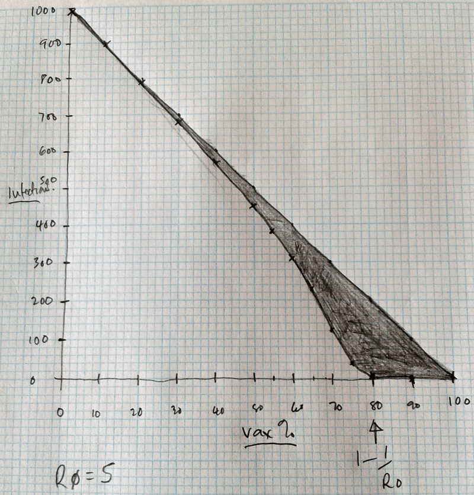

# Protect

A little demo to show how people are indirectly protected in an epidemic when enough people are vaccinated - herd immunity.

It should work on touch and non touch devices including phones; the layout being responsive to screen size.

The demo is not suitable for thinking about the elimination of a disease in an endemic steady state.  It is rooted in an epidemic context.

## Description

This demo executes an epidemic <a href="http://en.wikipedia.org/wiki/Compartmental_models_in_epidemiology">SIR model</a> in real time as sliders change the vaccination rate V (blue) and basic reproduction number R0 (green).  All standard SIR model assumptions hold.  The purpose is to show that as the vaccination rate increases, the number of people indirectly protected from disease increases non-linearly and steeply as the vaccination rate approaches the herd immunity threshold (1-1/R0), as depicted in this sketch:-

A single infection is used as the trigger.  The total number of people in the population (T) remains the same through the model.

The vaccine is assumed to be 100% seroprotective and long lasting - such that all those who are in the vaccinated fraction of the population are considered immune (and not infectious).  It would be easy to additionally model vaccine seroconversion rates, but essentially one can do the same by just lowering V.

The initial values for the SIR model are calculated as follows:-

<pre>
S = T(1-V)
I = 1
R = T-I-S
</pre>

i.e. the population is completely susceptible (S), other than: those vaccinated (who are assumed to be immune in R) and a single index case I.

The values of the three bars are then calculates as:-

<pre>
VACCINATED  = V * 100%
INFECTED = (SIR(S,I,R,R0) / T) * 100%
PROTECTED = 100% - VACCINATED - INFECTED
</pre>

For small values of R0, PROTECTED will have a value even when V=0, because of the low force of infection.  This is noted in the help tips rather than a whole new UI element introduced.  I tried to keep the UI very simple.

The model uses an elementary method to try and detect the end of the epidemic which typically converges in 20-100 iterations.  There is a safety limit of 2000 iterations, which is never hit using the constraints of the UI.  The SIR function itself is is defined as:-

<pre>
function sir(t,i0,s0,b,k) {
  var r0 = t-s0-i0;
  var s1 = s0;
  var i1 = i0;
  var r1 = r0;
  var cnt = 0;
  var itot = i0;
  var safe = 0;
  while(1) {
    safe++;
    if (safe &gt; 2000) {
      $('#debug').html('oops');
      break;
    }
    var inew = s1*i1*b;
    itot += inew;
    var rnew = k*i1;
    var s2 = s1 - inew;
    var i2 = i1 + inew - rnew;
    var r2 = r1 + rnew;
    if (inew &lt; 0.1) {
      cnt++;
      if (cnt &gt; 10)
        break;
    }
    else {
      cnt = 0;
    }
    s1=s2;
    i1=i2;
    r1=r2;
  }
  return itot;
}
</pre>

Note that R0 is parameterised as b and k as per standard SIR model formulations.  b being the contact rate per capita and k the recovery rate.  b is calculated as kR0 and k is fixed at 0.125.  This may seem like a limitation, but it is a property of SIR models that they behave similarly depending on b/k (R0), so the model need not be complicated by considering different recovery rates - it's all implicit in R0. Ditto for population size.

## Try it here

<a href="https://op12no2.github.io/protect">https://op12no2.github.io/protect</a>

## URL Initialisation

Parameters v (initial vaccination rate as a percentage) and r (initial R0) can be added to the URL to override the default values of nil and 7 respectively. For example:-

<a href="https://op12no2.github.io/protect?r=16">https://op12no2.github.io/protect?r=16</a>

<a href="https://op12no2.github.io/protect/?v=87&amp;r=6">https://op12no2.github.io/protect?v=87&amp;r=6</a>

<a href="https://op12no2.github.io/protect/?r=20&amp;v=100">https://op12no2.github.io/protect?r=20&amp;v=100</a>

This method allows R0 to be specified outside of the UI constraints.
